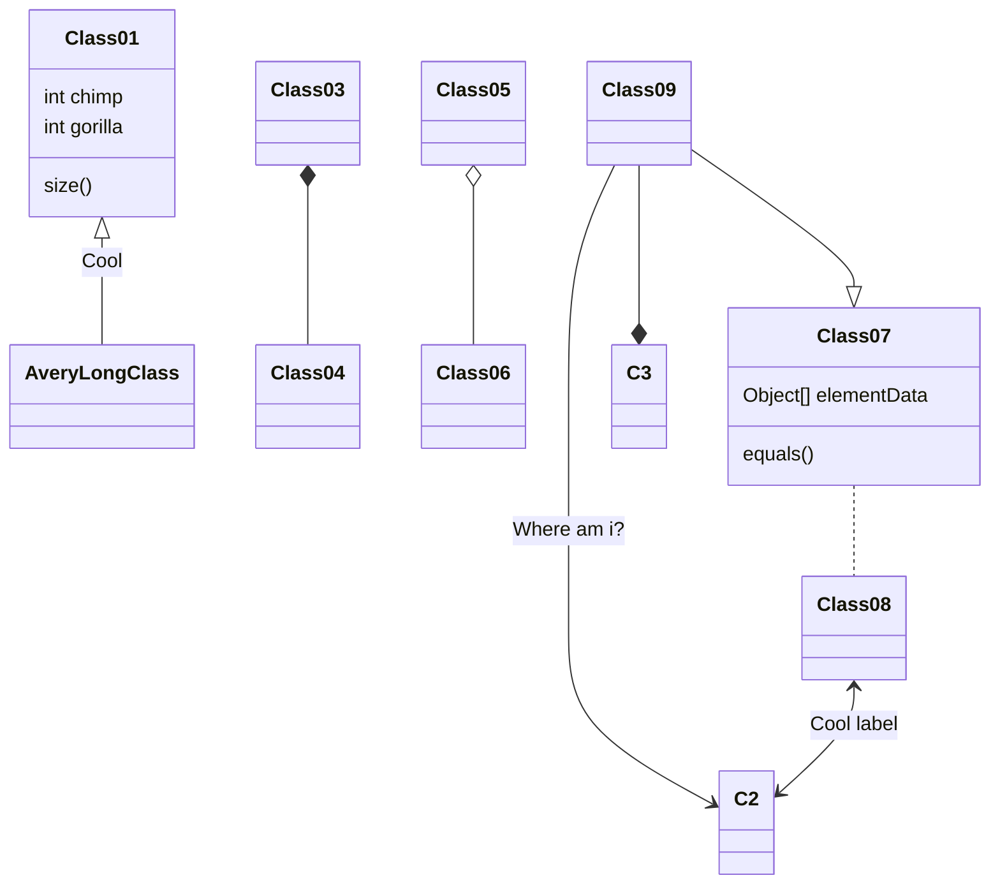
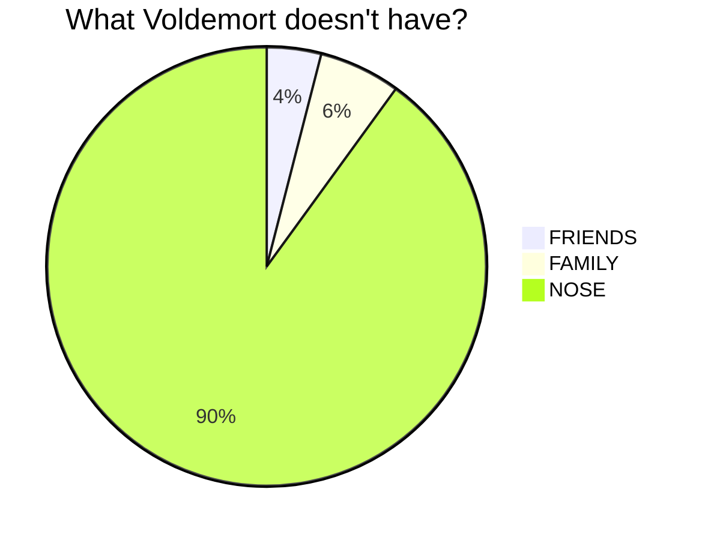
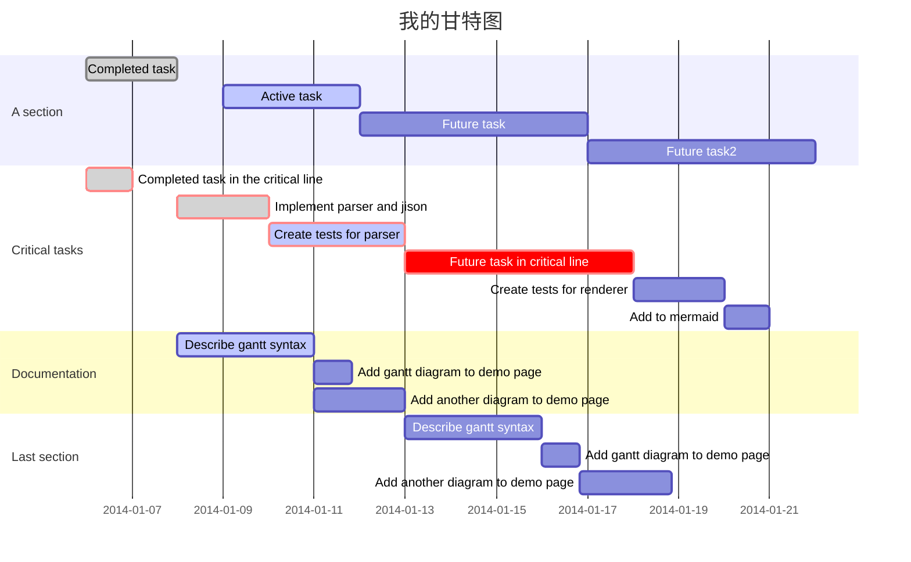
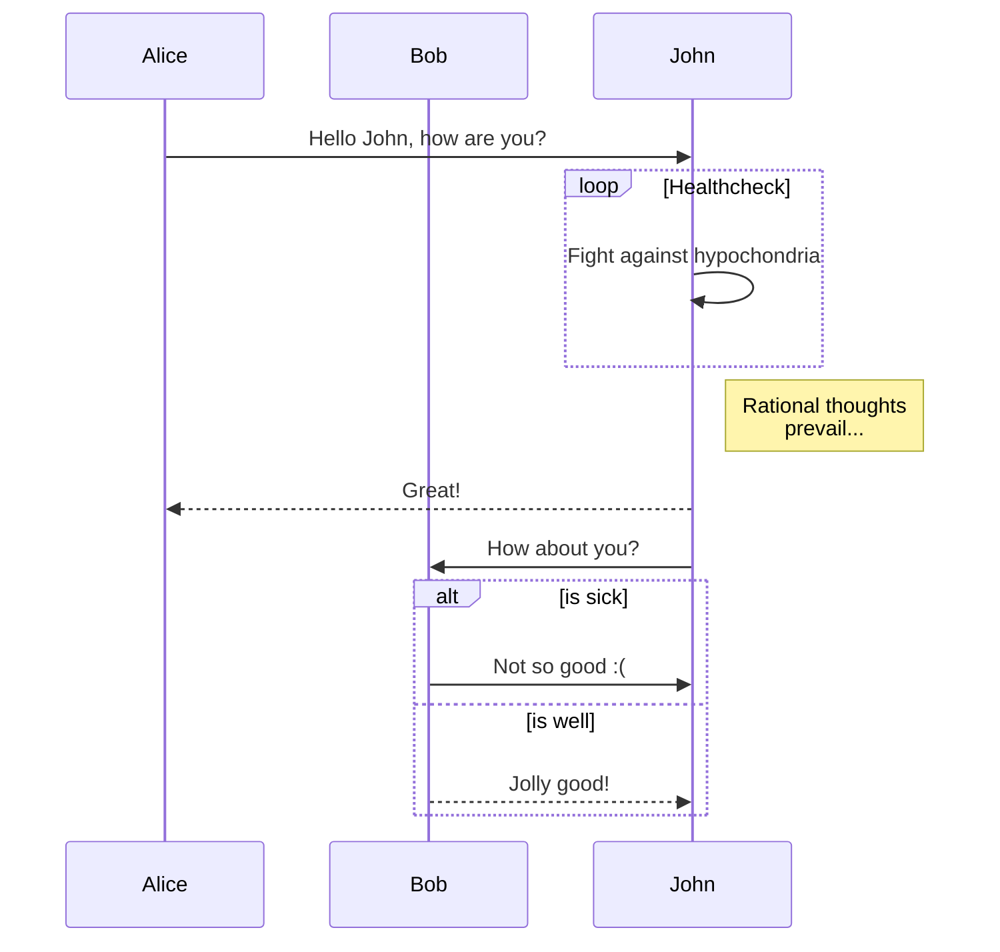
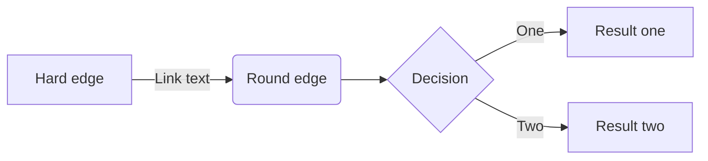
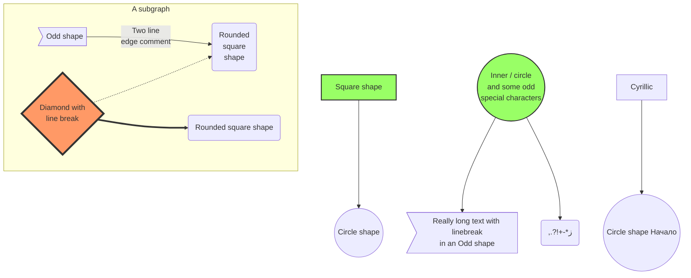

# 欢迎使用`新版`BookPad! :) ;)

> 请先预览本页! 
感谢您选择BookPad!如果您发现任何问题,欢迎到应用商店中给我们提出您宝贵的意见,我们会尽快修复!

本页是您在**BookPad**[^bookpad]中的第一个Markdown文档。如果您是第一次使用,本页将会对您十分有用,因为在这里您会看到**BookPad**的使用方法。 :fa-glass:
[^bookpad]: **BookPad** 是一个简单但又功能全面的Markdown编辑器。 

----------

## :fa-cog spin: 用法

新版的**BookPad**中我们舍弃了为您管理一个集中的Markdown文档目录的功能,因为对多数人来说自己管理自己的文档是一件并不困难的事情,而前一个版本的集中管理反而约束了用户的灵活性。

> **注:**
> - **BookPad**会自动保存您的文档不管您之前是否已经保存过,但是为了您的数据的安全,我们还是建议您定期手动保存:fa-save:。
> - 卸载**BookPad**将会**删除BookPad中您所有未保存的文档!** 请确保在卸载前您的文档已经保存。但是......为什么不留着**BookPad**呢?它会派上用场的! :fa-thumbs-o-up: :fa-smile-o: :fa-thumbs-o-up: :fa-sun-o: :fa-hand-rock-o: :fa-hand-peace-o:
> - 新版的BookPad在性能上有了很大的改善,所以默认状态下就开启了所有高级语法功能。==但依然需要注意==,在启用实时预览的情况下,性能将会有所下降(特别是当您的文档中有mermaid图表的时候)。非常抱歉!之后的版本中我们会继续改进。
> - 新版本中我们做了大量的优化,但肯定还有很多的问题,或是新引入的bug,所以有任何问题您都可以在Store中反馈,我们尽量排好优先级尽快解决。感谢您的支持! :pray: 

### :el-menu: 主菜单

新版的BookPad中我们对主菜单按钮做了些调整,它现在不会一直占用您的编辑区域(感谢老用户的建议! :fa-handshake-o: ),但会在编辑器的左下角露出一小部分,当您的鼠标靠近它的时候,它会弹出,此时您可以点击并打开主菜单。

###  :fa-files-o: 多文档支持

新版的Bookpad中我们添加了一项非常重要的功能,就是可以同时打开和编辑多个文档。同样需要感谢老用户的建议!有了这个功能,您不必再在多个文档之间来回切换。

### :fa-file: 创建新文档

您可以通过 *`新建`* 菜单或是`Ctrl + N`快捷键来创建新的文档,只不过这种方式创建的文档将会被保存在临时区域,您可以通过保存功能把它保存在任何您期望的位置。

### :fa-refresh: 打开文档

您可以通过 *`打开`* 菜单或是`Ctrl + O`快捷键来打开新的文档。

### :fa-share: 导出PDF`(新)`

您可以通过在菜单中选择 *`导出`* 或是`Ctrl + E`快捷键来导出。
但此功能尚有些缺陷和限制,如:
* 引用块不能跨页
* 着色强调文本不能跨行
* Mermaid图表不能导出(会被自动隐藏)
* 某些样式下可能存在冲突
* 等等

更重要的是,此功能允许您导出当前打开的一个文档,同时也允许您导出一个目录中指定数目的Markdown文档,并且您可以自定义它们被导出的顺序(勾选顺序就是导出顺序),所有的文档都会被自动合并到一个pdf文档中。

### :fa-globe: 预览文档

您可以通过 *`预览`* 菜单或快捷键`Ctrl + P`来预览当前文档。

### :fa-gears: 设置`(新)`

在新版本中,我们取消了设置页面,原因是您可以通过快捷键完成所有相应的功能。同时也取消了上传自定义css文件的功能(将来的版本中会添加)。

### :fa-bolt: 快捷键

下面列出了**BookPad**支持的所有快捷键:

#### 应用操作
* 新建文档: `Ctrl + N`
* 打开文档: `Ctrl + O`
* 保存文档: `Ctrl + S`
* 切换预览: `Ctrl + P`
* 切换实时预览: `Ctrl + Shift + P`
* 专注模式: `Ctrl + Shift + Enter`
* 导出PDF: `Ctrl + E`
* 帮助: `F1`
* 刷新: `F5`
* 编辑器前一个样式: `Ctrl + Up`
* 编辑器后一个样式: `Ctrl + Down`
* 编辑器默认样式: `Ctrl + Enter`
* 预览前一个样式: `Alt + Up`
* 预览后一个样式: `Alt + Down`
* 预览默认样式: `Alt + Enter`
* 预览代码前一个样式: `Shift + Alt + Up`
* 预览代码后一个样式: `Shift + Alt + Down`
* 预览代码默认样式: `Shift + Alt + Enter`
* 预览图表前一个样式: `Ctrl + Alt + Up`
* 预览图表后一个样式: `Ctrl + Alt + Down`
* 预览图表默认样式: `Ctrl + Alt + Enter`

#### 编辑器相关
* 全选: `Ctrl+ A`
* 删除当前行: `Ctrl + D`
* 搜索: `Ctrl + F`
* 搜索下一个: `Ctrl + G`
* 搜索上一个: `Ctrl + Shift + G`
* 持续搜索: `Alt + F`
* 替换: `Ctrl + Shift + F`
* 全部替换: `Ctrl + Shift + R`
* 跳到行: `Alt + G` 
* 撤销选中: `Ctrl + U`
* 重新选中: `Alt + U`
* 重做: `Ctrl + Y`
* 撤销: `Ctrl + Z`
* 向后缩进前前行: `Ctrl + ]`
* 向前缩进当前行: `Ctrl + [`
* 跳到文档开头: `Ctrl + Home`
* 跳到文档结尾: `Ctrl + End`
* 跳过前一个词: `Ctrl + Left`
* 跳过后一个词: `Ctrl + Right`
* 跳到本行开头: `Alt + Left`
* 跳到本行结尾: `Alt + Right`
* 删除前一个词: `Ctrl + Backspace`
* 删除后一个词: `Ctr + Delete`
* 向后缩进: `Tab`
* 向前缩进: `Shift + Tab`
* 切换显示行号: `Ctrl + Shift + L`
* 切换显示工具栏: `Ctrl + Shift + T`
* 增大编辑器字体: `Ctrl + +`
* 缩小编辑器字体: `Ctrl + -`

#### 编辑器工具栏和Markdown语法
* 粗体: `Ctrl-B`
* 斜体: `Ctrl-I`
* 表格: `Ctrl-T`
* 标题: `Ctrl-H`
* 饮用: `Ctrl-'`
* 链接: `Ctrl-L`
* 下标: `Ctr-,`
* 上标: `Ctr-.`
* 水平线: `Ctrl-R`
* 下划线: `Ctrl-Alt-U`
* 代码: `Ctrl-Alt-'`
* 图片: `Ctrl-Alt-L`
* 脚注: `Ctrl-Alt-N`
* 图标: `Ctrl-Alt-:`

----------

## Markdown语法
您可以在[这里](4)找到更多关于Markdown语法的内容。

### 基本语法
#### 标题
* # 这是一号标题H1
* ## 这是二号标题H2
* ### 这是三号标题H3
* #### 这是四号标题H4
* ##### 这是五号标题H5
* ###### 这是六号标题H6
* 这不是标题而是正文内容

#### 强调
* 斜体 = 两边分别加一个 `*` 或 `_`;
* 粗体 = 两边分别加两个 `*` 或 `_`;
* 粗体加斜体 = 两边分别加三个 `*` 或 `_`;
* 删除线 = 两边分别加两个 `~`;
* 上标 = 两边分别加一个 `~`;
* 下标 = 两边分别加一个 `^`;
* 下划线 = 两边分别加两个以上 `+`;
* 着色 = 两边分别加两个以上 `=`;
* 定义缩写 = `*[缩写]`;
* 下面是一个列子:

*一个星号斜体*
_一个下划线斜体_
**两个星号粗体**
__两个下划线粗体__
***三个星号粗体加斜体***
___三个下划线粗体加斜体___
~~删除我~~
M~x~
X^3^
++你好吗?++
请 ==不要== 卸载 BookPad

*[HTML]: 超文本链接标示语言
BookPad可以以 HTML 来预览格式化结果,在预览模式下你可以把鼠标放在 HTML 上来看它的定义。


#### 引用
> 这是一个包含两个段落的引用。
> 在每个段落里都有多行内容。
> 
> 这是一个包含两个段落的引用。
> 在每个段落里都有多行内容。

#### 列表
可以在行的最前面放一个 `*`, `+` 或 `-`来表示无序列表:
*   红色
*   绿色
*   蓝色
    * 深蓝色
    * 浅蓝色

等同于:

+   红色
+   绿色
+   蓝色

也等同于:

-   红色
-   绿色
-   蓝色

有序列表用数字加一个点号来表示:

1.  第一项
2.  第二项
    1. 子项 2.1
8.  第三项(虽然前面写的是8)
    1. 子项 3.1

#### 水平线
你可以通过将三个或更多的短横线、星号或下划线放在单独的一行来产生一个水平线。如果你愿意,你可以它们之间加入空格。下面的每一行都会产生一个相同水平线:

**********************************
* * *
----------------------------------
-  -  - 
__________________________________
_ _ _

#### 链接
我常用的搜索引擎有: [谷歌](http://www.google.com), [必应](http://www.bing.com) 和 [百度](http://www.baidu.com).
我常用的搜索引擎有: [谷歌][1], [必应][2] 和 [百度][3].
我常用的搜索引擎有: [谷歌][谷歌], [必应][必应] 和 [百度][百度].
我常用的搜索引擎有: [谷歌][], [必应][] 和 [百度][].
我常用的搜索引擎有: <http://www.google.com>, <http://www.bing.com> 和 <http://www.baidu.com>.

然后你可以定义下面的链接,并把它们放在文档中任何你希望的地方。它们不会直接显示出来,而是只会被上面的链接所使用。

[1]: http://www.google.com/        "谷歌"
[2]: http://www.bing.com/ 	"必应"
[3]: http://www.baidu.com/   	 "百度"

[谷歌]: http://www.google.com/ "谷歌"
[必应]: http://www.bing.com/ 	 "必应"
[百度]: http://www.baidu.com/   	 "百度"

#### 反斜杠
Markdown里面可以使用反斜杠转意下面的字符(因为它们有特别的含义,所以当你希望看到它们本身的时候需要转意):
* \\   反斜杠
* \`   反引号
* \*   星号
* \_   下划线
* \{\}  大括号
* \[\]  中括号
* \(\)  小括号
* \#   井号
* \+   加号
* \-   减号
* \.   点号
* \!   惊叹号

#### 内嵌HTML
对于任何没有被Markdown语法与重新定义的HTML内容你都可以在Makdown文档中直接使。你不需要加特别的标记来告诉解析器你是在使用Markdown还是在使用HTML。你需要的只是HTML标签本身。

唯一需要注意的是那些像\<div\>, \<table\>, \<pre\>, \<p\>等的块标签需要在前后加上一个空行,并且开头和结束标签本身前面没有空格或tab键。Markdown不会再自动在这些块标签前后加上多余的\<p\>。

例如你可以直接在Markdown文档中使用下面的HTML来画一张表:


<table>
    <tr>
        <td>一些内容</td>
        <td>一些内容</td>
        <td>一些内容</td>
    </tr>
	<tr>
        <td>一些内容</td>
        <td>一些内容</td>
        <td>一些内容</td>
    </tr>
    <tr>
        <td>一些内容</td>
        <td>一些内容</td>
        <td>一些内容</td>
    </tr>
</table>

### Markdown扩展语法
#### 术语定义列表

术语 1
术语 2
:   这是第一种定义 A
:   这里是第二种定义 B

术语 3
:   这里是第一种定义 C
:   这里是第二种定义 D

#### 表格
配件		| 价格
------	| ---
主板		| 5000¥
键盘		| 200¥
显示器	| 2000¥

你可以用**半角**冒号来使用列对齐:

| 配件		| 价格		|数量	|
| :------		| ---:		|:---:	|
| 主板		| 5000¥	| 80	|
| 键盘		| 200¥		| 200	|
| 显示器	| 2000¥	| 100	|


#### 代码高亮

```java
/* HelloWorld.java
 */

public class HelloWorld
{
	public static void main(String[] args) {
		System.out.println("Hello World!");
	}
}
```

``` python
#!/usr/bin/python
# Say hello, world.
print "Hello, world!"
```

```html
<!DOCTYPE html>
<title>Title</title>

<style>body {width: 500px;}</style>
<script type="application/javascript">
  function $init() {return true;}
</script>

<body>
  <p checked class="title" id='title'>Title</p>
  <!-- here goes the rest of the page -->
</body>
```

#### 数学公式
**BookPad**支持用**MathJax**来显示*LaTeX*格式的数学公式。你在 [这里][5] 可以找到更多的信息。比如:

满足 $\Gamma(n) = (n-1)!\quad\forall n\in\mathbb N$ 的*伽马方程*需要通过积分求解:

$$
\Gamma(z) = \int_0^\infty t^{z-1}e^{-t}dt\,.
$$

#### 时序图

```diagram
张三->李四: 你好啊,张三
Note right of 李四: 呵呵
李四-->张三: 挺好的,你呢?
```

#### 流程图


```flow
st=>start: 开始
e=>end: 结束
op=>operation: 我的操作
cond=>condition: 是 或 否?

st->op->cond
cond(yes)->e
cond(no)->op
```

#### 支持Mermaid图

##### 使用mermaid画UML类图


##### 使用mermaid画饼图



##### 使用mermaid画甘特图



##### 使用mermaid画时序图



##### 使用mermaid画流程图




##### 带有格式的mermaid流程图


> **注:** 你可以在下面的链接中找到更多的内容:
> - 关于 **时序图** 的语法在[这里][6],
> - 关于 **流程图** 的语法在[这里][7],
> - 关于 **Mermaid** 的语法在[这里][11]。

#### 嵌入图片

你可以在Markdown文档的任何位置插入一个外部或本地的图片, 还可以像下面所示用`{200}`指定图片高和宽都为`200`,或用`{200x400}`来指定图片高为`200`,宽为`400`。如果不指定,图片会以默认大小显示:


#### 脚注

你可以像这样创建一个脚注[^我的脚注].

  [^我的脚注]: 这里是*我的脚注*的具体内容,这一行脚注将会被自动放在整个文档的最后。

#### 自动目录

你可以在文档的任何位置使用 `[TOC]`来插入自动目录,但这个标记需要自己占用单独的一行:

   [TOC]

#### 特殊符号

&copy; &trade; &iexcl; &pound;

&amp; &lt; &gt; &yen; &euro; &reg; 

&plusmn; &para; &sect; &brvbar; &macr; &laquo; &middot; 

&frac34; &times;  &divide; &raquo;

## 嵌入图标
**BookPad**支持font awesome图标[8],stack icons图标[9]和Glyphicon图标[10]和Emoji等多种图标。比如:

:fa-asterisk:
:st-addthis r5:
:fa-address-book:
:fa-bath:
;)
:pizza:


[4]: http://daringfireball.net/projects/markdown/syntax
[5]: http://meta.math.stackexchange.com/questions/5020/mathjax-basic-tutorial-and-quick-reference
[6]: http://bramp.github.io/js-sequence-diagrams/
[7]: http://adrai.github.io/flowchart.js/
[8]: http://fontawesome.io/
[9]: http://stackicons.com/
[10]: http://glyphicons.com/
[11]: https://mermaidjs.github.io/
